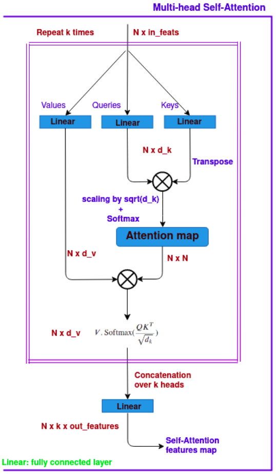
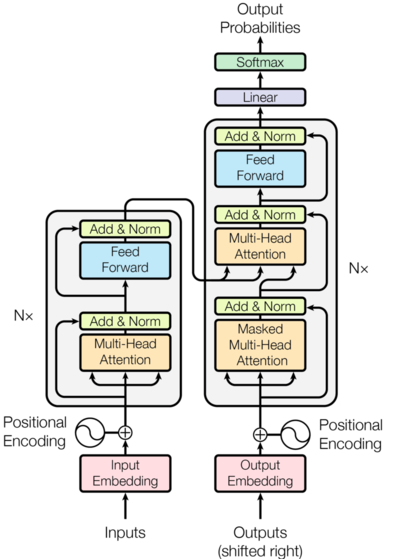

# Attention-Is-All-You-Need
Implmenetation of self-attention, multi-head Attention and Transformer networks and testing on a toy dataset.

## Introduction
In 2017, Vaswani et al. introduced in their [paper](https://arxiv.org/abs/1706.03762) a new idea called: "self-attention" which was a great advance in the use of attention mechanism, being the main improvement for a model called: "Transformer". The most famous current models that are emerging in NLP tasks consist of dozens of transformers or some of their variants, for example, GPT-2 or BERT. And more recently, dozens of transformers are incorporated in visual applications, so-called: vision transformers.

<p float="center">
  
   
</p>


## Requirements
The experiments were performed using Python 3.8.5. To install the necesssary packages, please run the following command:
```
pip3 install http://download.pytorch.org/whl/cu80/torch-0.3.0.post4-cp36-cp36m-linux_x86_64.whl numpy matplotlib seaborn 
```


### Acknowledgment
We relied mainly on this explanation [here](https://nlp.seas.harvard.edu/2018/04/03/attention.html).
